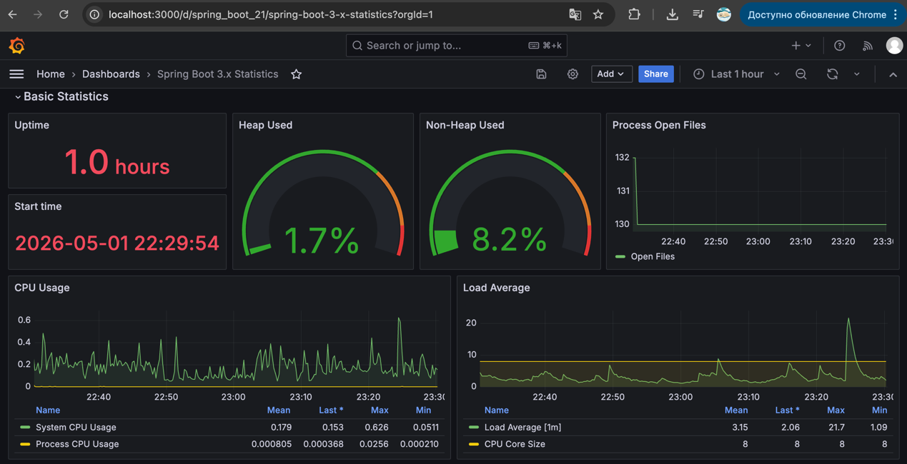
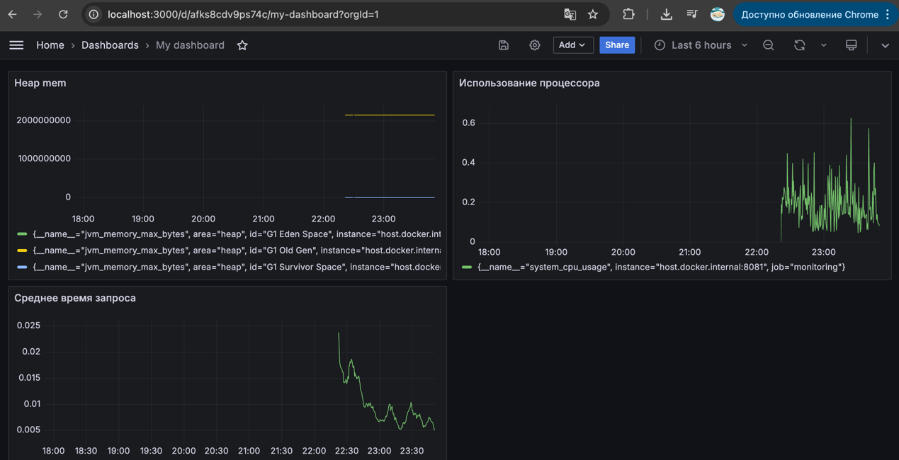

***Домащняя работа по Troubleshooting***

  

### Анализ нагрузки потоков (Thread Dump)

На основе снятого дампа потоков был рассчитан процент занятого процессорного времени для выделения топ-3 самых нагруженных потоков.
Формула расчета: `Процент нагрузки = (cpu_ms / (elapsed * 1000)) * 100%`

| Название потока | Время жизни потока (elapsed) | Время работы потока (cpu_ms) | Процент нагрузки |
| :--- | :--- | :--- | :--- |
| C2 CompilerThread0 | 217.21s | 11713.14ms | 5.39% |
| http-nio-8081-exec-4 | 213.38s | 5149.56ms | 2.41% |
| http-nio-8081-exec-1 | 213.38s | 3249.87ms | 1.52% |

***Скриншоты из графаны***

## Мониторинг (Actuator, Prometheus, Grafana)

В проекте подключен Spring Boot Actuator с экспортом метрик для Prometheus. Для визуализации используется Grafana.

### Настройка и запуск

1.  **Зависимости:** В `pom.xml` добавлены `spring-boot-starter-actuator` и `micrometer-registry-prometheus`.
2.  **Конфигурация:** В `application.yml` открыт endpoint `/actuator/prometheus`.
3.  **Инфраструктура:** Prometheus и Grafana запускаются через `docker compose up`

### Используемые PromQL запросы и метрики (для кастомного дашборда)

| Панель Grafana | PromQL запрос | Описание метрики |
| :--- | :--- | :--- |
| **System CPU Usage** | `system_cpu_usage` | Показывает общую загрузку CPU всей системы, где запущено приложение. Значение `1.0` означает 100% загрузку одного ядра. |
| **JVM Heap Memory Used** | `jvm_memory_used_bytes{area="heap"}` | Отображает текущий объем используемой памяти в куче JVM (в байтах). Позволяет отслеживать потребление памяти приложением. |
| **Avg Response Time per URL** | `sum by(uri) (rate(http_server_requests_seconds_sum[5m])) / sum by(uri) (rate(http_server_requests_seconds_count[5m]))` | Рассчитывает и отображает среднее время ответа для каждого URL эндпоинта за последние 5 минут. Суммирует общее время запросов и делит на их количество. |
